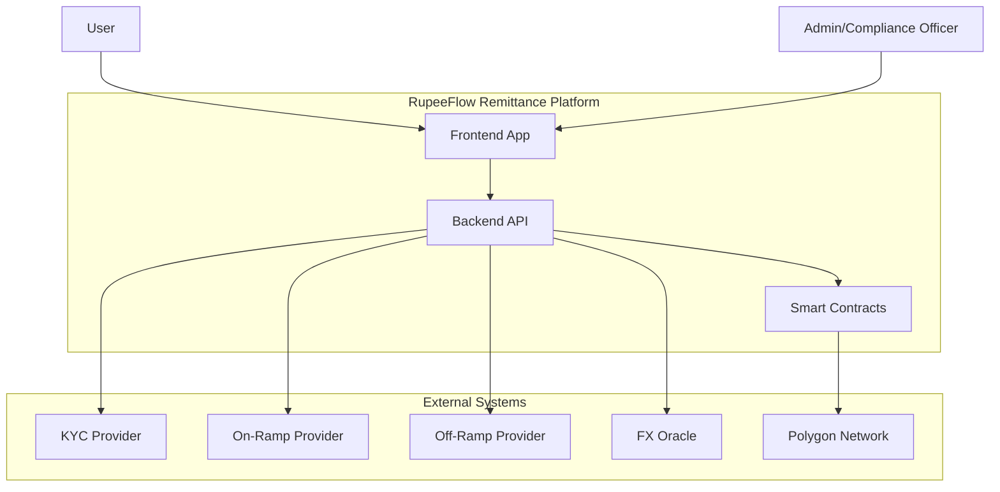
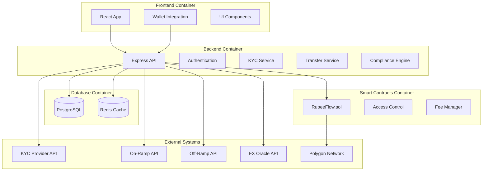
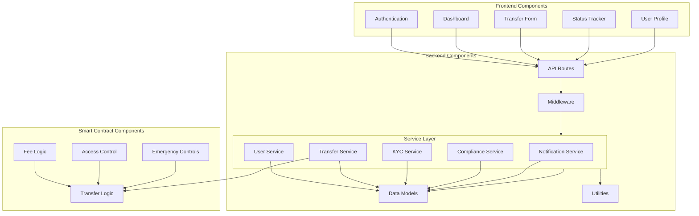
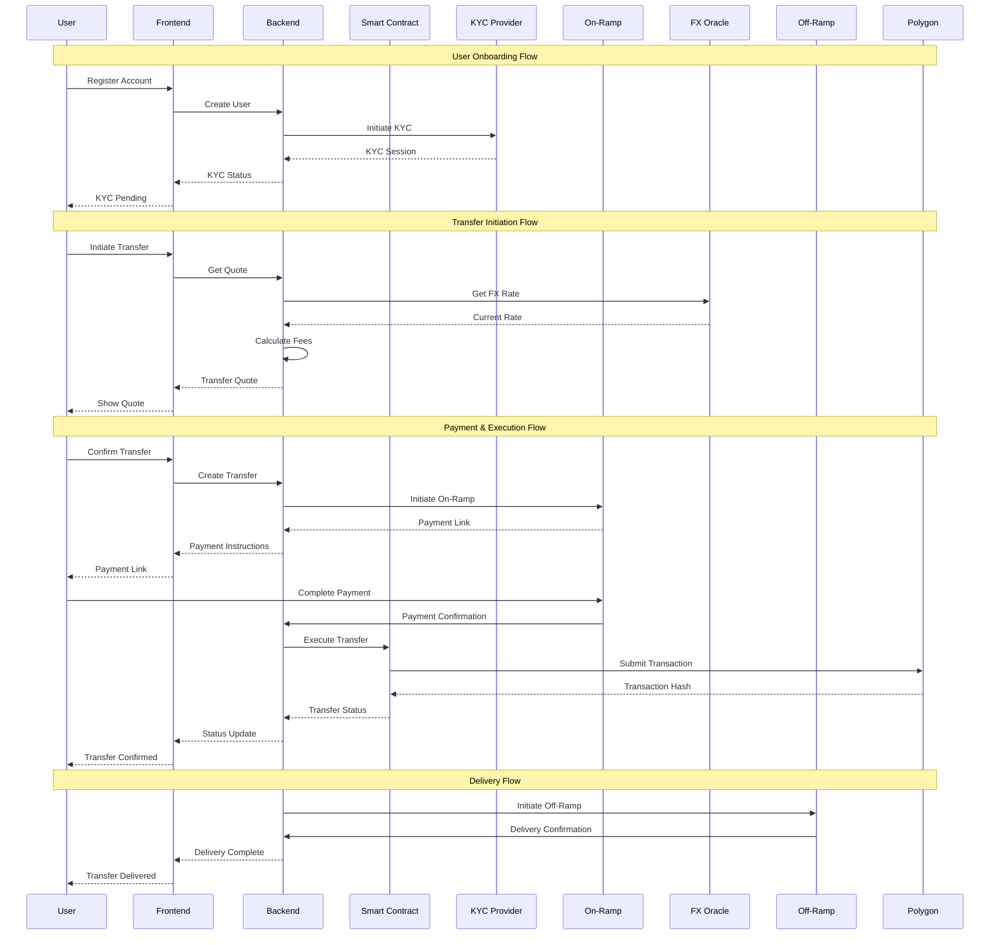
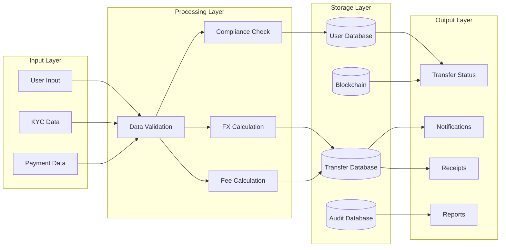
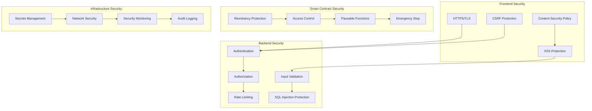

# RupeeFlow - System Architecture

## C4 Model

### Level 1: System Context Diagram

### Level 2: Container Diagram

### Level 3: Component Diagram

## System Flow Diagram

## Data Flow Architecture

## Security Architecture

## Deployment Architecture

```mermaid
graph TB
    subgraph Development["Development Environment"]
        DevFrontend[Frontend Dev]
        DevBackend[Backend Dev]
        DevContracts[Smart Contracts Dev]
        DevDB[Local Database]
    end
    
    subgraph Testing["Testing Environment"]
        TestFrontend[Frontend Test]
        TestBackend[Backend Test]
        TestContracts[Testnet Contracts]
        TestDB[Test Database]
    end
    
    subgraph Staging["Staging Environment"]
        StagingFrontend[Frontend Staging]
        StagingBackend[Backend Staging]
        StagingContracts[Testnet Contracts]
        StagingDB[Staging Database]
    end
    
    subgraph Production["Production Environment"]
        ProdFrontend[Frontend Production]
        ProdBackend[Backend Production]
        ProdContracts[Mainnet Contracts]
        ProdDB[Production Database]
    end
    
    DevFrontend --> DevBackend
    DevBackend --> DevContracts
    DevBackend --> DevDB
    
    TestFrontend --> TestBackend
    TestBackend --> TestContracts
    TestBackend --> TestDB
    
    StagingFrontend --> StagingBackend
    StagingBackend --> StagingContracts
    StagingBackend --> StagingDB
    
    ProdFrontend --> ProdBackend
    ProdBackend --> ProdContracts
    ProdBackend --> ProdDB
```

## Technology Stack

### Frontend
- **Framework**: React 18 with TypeScript
- **State Management**: React Context + Hooks
- **UI Library**: Tailwind CSS + Headless UI
- **Wallet Integration**: WalletConnect v2 + MetaMask
- **Build Tool**: Vite

### Backend
- **Runtime**: Node.js 18+
- **Framework**: Express.js with TypeScript
- **Authentication**: JWT + Passport.js
- **Validation**: Joi + Express-validator
- **Testing**: Jest + Supertest

### Smart Contracts
- **Language**: Solidity 0.8.19+
- **Framework**: Hardhat
- **Libraries**: OpenZeppelin Contracts
- **Testing**: Hardhat + Chai
- **Networks**: Polygon Mumbai/Amoy (testnet)

### Database
- **Primary**: PostgreSQL 14+
- **Cache**: Redis 6+
- **ORM**: Prisma
- **Migrations**: Prisma Migrate

### Infrastructure
- **Containerization**: Docker
- **CI/CD**: GitHub Actions
- **Monitoring**: Prometheus + Grafana
- **Logging**: Winston + ELK Stack
